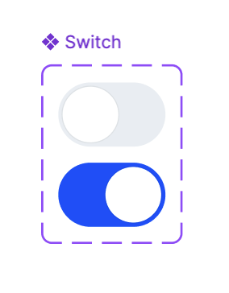

# 과제. UI 컴포넌트 제작

 [피그마 참고 자료](<https://www.figma.com/design/VDGh1Q0R8Yrnu4jI26xQ84/UI-Develop-Practice-(Copy)?node-id=0-1&p=f&t=aP9pgIZaXaq42niI-0>)

## 목차📌

1. [스위치](#1-1)
2. [칩 버튼](#1-2)
3. [프로필](#1-3)
4. [회고](#회고)

## 1-1

### 스위치 컴포넌트 제작 ✅

### 제공된 UI 이미지



### 구현한 스위치 컴포넌트


## 웹 접근성

스위치의 웹 접근성을 고려해 input type=checkbox로 스위치를 제작, CSS를 이용해 UI 구성했습니다.

```js
export default function SwitchComponent(): React.ReactElement {
  return h(React.Fragment, null, h("label", { htmlFor: "toggle", className: "sr-only" }, "토글버튼"), h("input", { type: "checkbox", id: "toggle", className: "toggle-button" }));
}
```

## 1-2

## 1-3

## 회고 🤔

과제를 시작하며 이전 바닐라 프로젝트 때 checkbox로 UI를 만들었던게 생각나 이번에도 checkbox를 이용해 스위치 컴포넌트를 제작했다.

input 태그는 html의 태그이기 때문에 div로 커스텀 하는 것보다 접근성이 좋을 거라 생각한다. 또, js의 도움 없이 체크를 할 수 있다는 점도 좋았던 것 같다.

코드를 작성하는데에는 큰 어려움은 없었지만 환경 구성에 조금 애를 먹었었다. 그래서 기존에 사용하던 파일을 이용해 어떻게 하긴 했지만 조금 찝찝한 기분도 든다.

원래는 3가지 컴포넌트 모두 만들 생각이었지만 주말동안 타지역에 가게 되어 2,3번을 못한게 조금 아쉽다. 다음 과제는 더 열심히 해야겠다. 🥲
